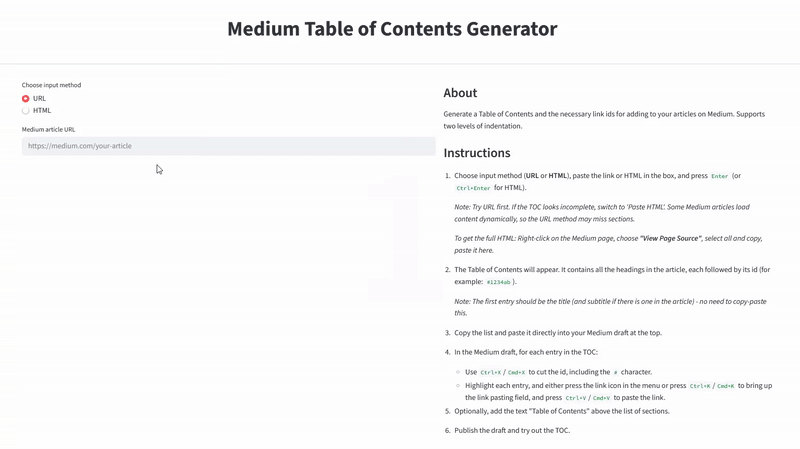

# Medium Table of Contents Generator

  

A simple web app that generates a Table of Contents (TOC) for Medium articles.

**Why?** Medium doesn’t support automatic TOC generation when creating articles.

## What it does

- Extracts all section headings from a Medium article
- Keeps their order and indentation (based on heading level)
- Shows each heading’s ID so you can manually add internal links

## Technical info
- Built with Python and streamlit, deployed on streamlit.io.